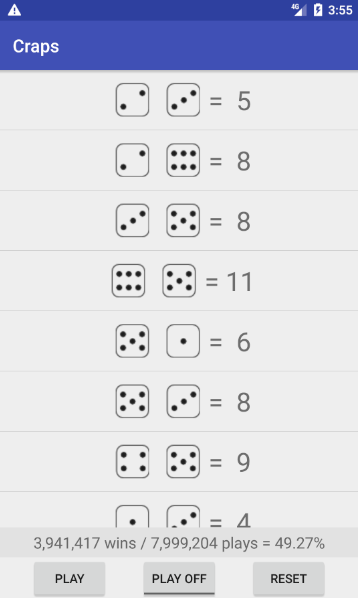

# Android Craps Simulator

An app that simulates the game of craps. As you play it will display your
number of plays, wins, and your total win percentage. The UI will display
your rolls for the current game using dice images as well as the total sum
of the two dice. If you are unfamiliar with the rules for the game you can
find them [here](https://www.casinotop10.net/craps-rules). The UI also
contains three buttons: Play, Play On/Off, and Reset

-Play: pressing the button will play an individual game and update the
rolls on screen to match the rolls for the game.

-Play On/Off: turning the toggle to on by pressing it will cause the app
to play games as fast as it is able. The UI will update the on screen 
rolls and statistics(plays, wins, and win percentage) roughly every 
100,00 games played.

-Reset: pressing the button will cause the game to reset, which means
the rolls on screen will clear and all of your statistics(plays, wins, 
and win percentage) will reset to zero.
